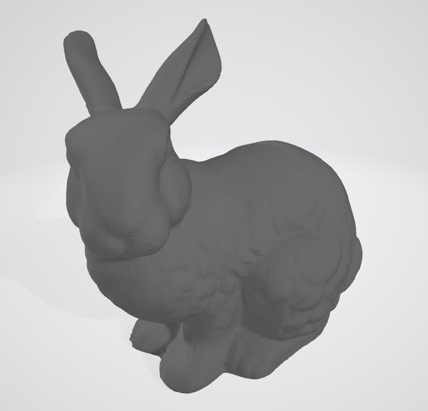
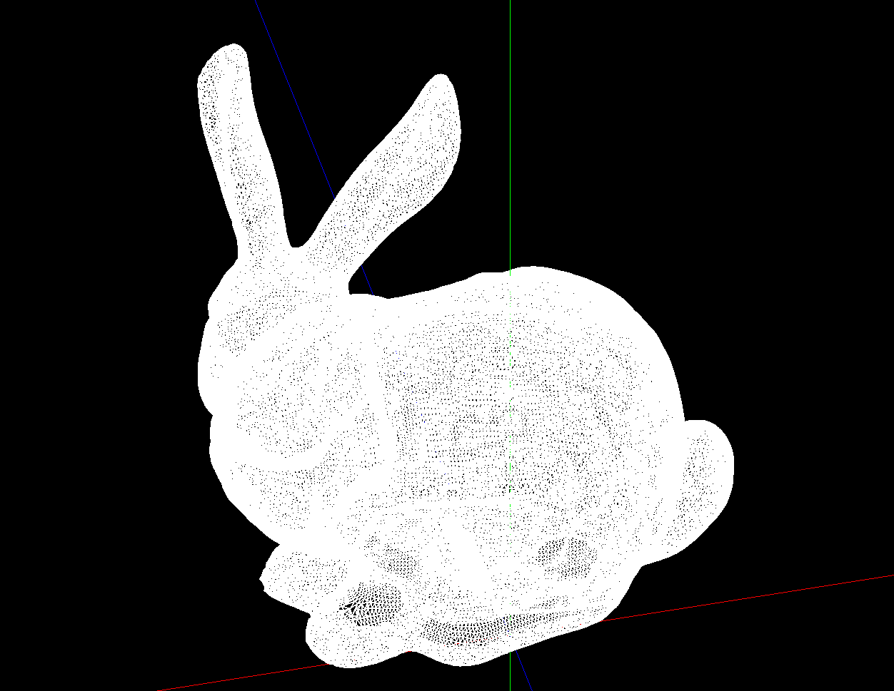
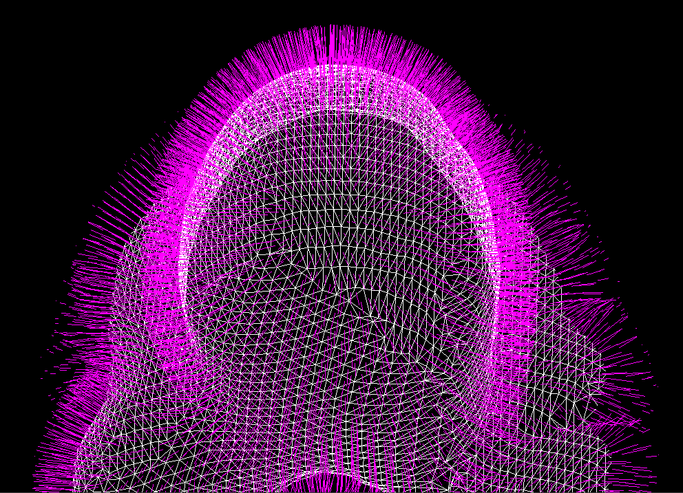
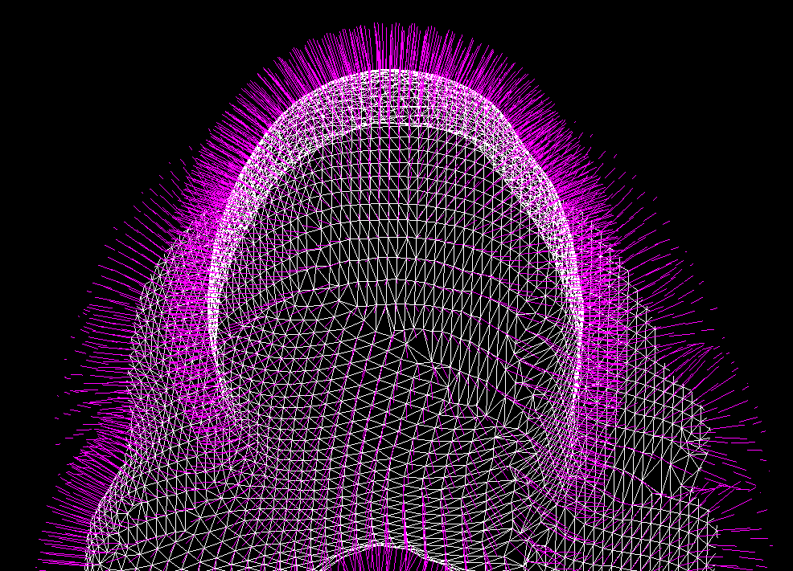

# Geometry Algorithms
This project explores fundamental geometry algorithms used in
CAD kernels, mesh processing systems, and computational geometry engines.
 
## Current Features

### Mesh Processing
- OBJ Loader
- Triangle Mesh Rendering
- Orbit Camera
- Bounding Box Fitting
- Stanford Bunny Rendering
- Face Normal Visualization
- Vertex Normal Visualization

### Computational Geometry
- 2D Polygon Representation
- Polygon Rendering
- Polygon View Fitting
- Polygon Area (Shoelace Formula)
- Polygon Orientation (CW/CCW)
- Point-In-Polygon (Ray Casting)

 
## OBJ Mesh Rendering
The Stanford Bunny (Vertices: 35947, Faces: 69451)
| Source Mesh | Geometry Algorithms |
|------------|------------|
|   |  |

 
## Face Normals vs Vertex Normals
| Face Normals | Vertex Normals |
|------------|------------|
|   |  |

 
## Roadmap
### Computational Geometry
- [x] Polygon Rendering
- [x] Polygon Area Calculation
- [x] Point In Polygon (PIP)
- [ ] Line Segment Intersection
- [ ] Polygon Triangulation
- [ ] Convex Polygon Clipping
- [ ] Polygon Boolean Operations
- [ ] Polygon Offset
- [ ] SVG Export
 
### Mesh Processing
- [x] OBJ Loader
- [x] Wireframe Mesh Rendering
- [x] Face Normal Visualization
- [x] Vertex Normal Visualization
- [ ] Half-Edge Data Structure
- [ ] Laplacian Smoothing
- [ ] Mesh Simplification
- [ ] Subdivision
- [ ] Curvature Visualization
 
### Research
- [ ] Geometry Processing Pipeline
- [ ] Gaussian Splatting Experiments
